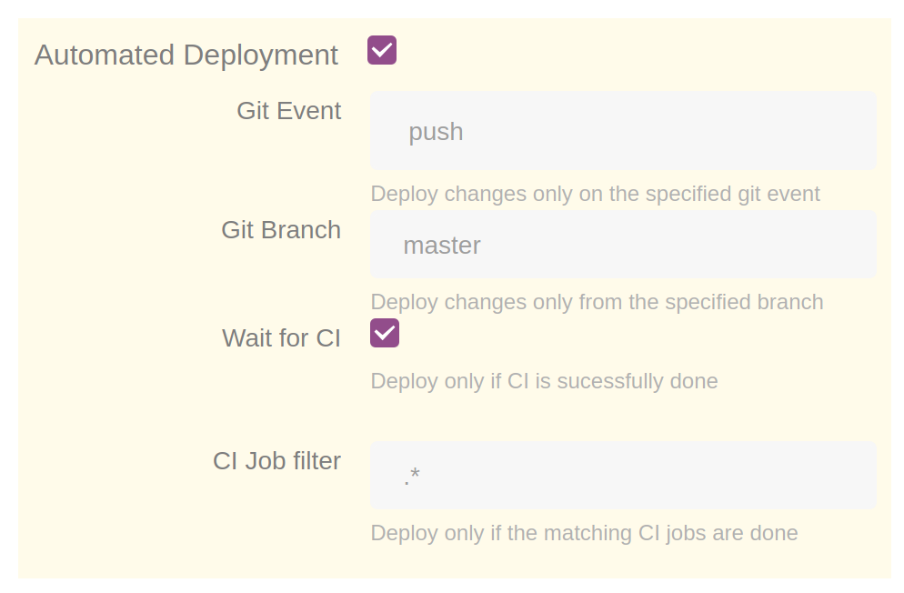

# Deployment workflows

So far you have seen how to deploy any git revision on-demand from the UI.

On this page you will learn how Gimlet can be added to your software delivery pipeline and automate deployment on common events like git push to master, or git tag.

You can deploy with Gimlet from existing CI pipelines, or you can set up declarative Gimlet triggers that don't require wiring in CI.

## Deploy from an existing CI pipeline

If your CI pipeline already has a deployment step, you can trigger the deployment with Gimlet with a webhook.

Replace your existing deployment code with an HTTP call to Gimlet.

```bash
curl --header "Content-Type: application/json" \
  --request POST \
  --data '{' \
    '"env":"staging",' \
    '"method":"adhoc",' \
    '"triggeredBy":"laszlocph",' \
    '"app":"demo-app"' \
    '}' \
  https://mycompany.gimlet.io/api/repo/:owner/:name/commit/:commit/deploy?access_token=:token
```

## Gimlet deploys that don't require wiring in CI

The webhook based deployment is a straight forward approach to introduce Gimlet to any existing CI pipeline.

With declarative Gimlet deploys, Gimlet listens on common git events and deploys your application according to the specified policies. No need for deployment steps in CI anymore.

If your deployment policies can be stated like the following, Gimlet will do the job:

- *"We deploy every master push to our Staging environment"*
- *"We deploy tags on master to our Production environment"*
- *"Feature branches with the `feature/` prefix needs to be deployed on preview environments"*

!!! note ""

    With declarative deploys CI still needs to build the docker image, and do so in harmony of the deployment policies you set in Gimlet.

## Deployment policy

You can enable automated deployments on the repository settings view, or in the `gimlet.yaml` file.

The following examples show a CD setup to the production environment. Any push on master is deployed, once the CI pipeline finished running.



```yaml
envs:
  production:
    - name: aedes
      ...
      deploy:
        event: push
        branch: master
        waitForCI: true
        ciJobFilter: .*  
```

### Rules

In a policy you can set deployment rules on git event, branch, and CI.

- All rules are optional
- All specified rules must be evaluated as true for a deployment to happen
- By default the automated policy based deployments are disabled. You can use ad-hoc deploys, see [Deploy any version on-demand](#deploy-any-version-on-demand)

#### Git Event

You can specify which git events trigger a deployment. Possible values: `push`, `tag`

The following example shows a git tag based deployment:

```yaml
envs:
  production:
    - name: aedes
      ...
      deploy:
        event: tag
        branch: master
```

#### Git Branch

Changes made to this git branch trigger a deployment. Default value: `master`.

Regular expressions are allowed.

The following example shows how to do CD to production:

```yaml
envs:
  production:
    - name: aedes
      ...
      deploy:
        event: push
        branch: master
```

#### Waiting for CI to finish

Deployments depend on deploy artifacts to be ready. With this rule enabled, deployment will start after CI is successfully finished.

The following example shows how to do CD to production, and require that CI job triggered by this event to finish.

```yaml
envs:
  production:
    - name: aedes
      ...
      deploy:
        event: push
        branch: master
        waitForCI: true
```

#### CI job filter

Some CI workflows (like in CircleCI) trigger multiple jobs on a single git event. This filter specifies which CI job needs to successfully finish for the deployment to happen.

Regular expressions are allowed.

```yaml
envs:
  production:
    - name: aedes
      ...
      deploy:
        event: push
        branch: master
        waitForCI: true
        ciJobFilter: .*/artifact_build
```

Gimlet evaluates the filter against the Github status line generated by the CI job.

Examples:

- `continuous-integration/drone/push` indicates a job triggered by a git push.<br />
For this status line the `ciJobFilter` is usually not necessary as there is only a single status line created by CI.
If you want to set an explicit rule for this case, use the `.*` regex.

- `ci/circleci: build-docker-image` is sent when your job with name `build-docker-image` is done.<br />
CircleCI sends a status line for each job in your workflow. Set `.*/build-docker-image` to trigger the deploy only after this job.

## Deployment policy examples

#### Deploy any version on-demand

You can make ad-hoc deployments either on the UI, or with webhooks.

- For webhooks, see [Deploy from an existing CI pipeline](#deploy-from-an-existing-ci-pipeline)
- For UI, see [Deploy a revision](/developers/deploy#deploy-a-revision) section from the Deploying a new service guide.

#### Deploy master on git push

By using the git event and branch rules, and waiting for CI to finish building the artifacts, the ruleset looks like this:

```yaml
envs:
  production:
    - name: aedes
      ...
      deploy:
        event: push
        branch: master
        waitForCI: true
```

#### Deploy master on git tag

Git tag is used as an explicit intent to deploy a new version.

Typically, docker images are already built for the revision, and the tag is used for promotion to a specific environment.
That said, CI is not generating an artifact and the ruleset can be written as:

```yaml
envs:
  production:
    - name: aedes
      ...
      deploy:
        event: tag
        branch: master
```

Should you run a CI workflow on git tag, like retagging the docker image with the semantic version used in the git tag, use the following ruleset:

```yaml
envs:
  production:
    - name: aedes
      ...
      deploy:
        event: tag
        branch: master
        waitForCI: true
```

If you use CircleCI and have a complex workflow on git tag, add a `ciJobFilter` as well:

```diff
envs:
  production:
    - name: aedes
      ...
      deploy:
        event: tag
        branch: master
        waitForCI: true
+       ciJobFilter: .*/apply-semantic-version
```

<!-- Fathom - beautiful, simple website analytics -->
<script src="https://cdn.usefathom.com/script.js" site="KVEHKPCQ" defer></script>
<!-- / Fathom -->
