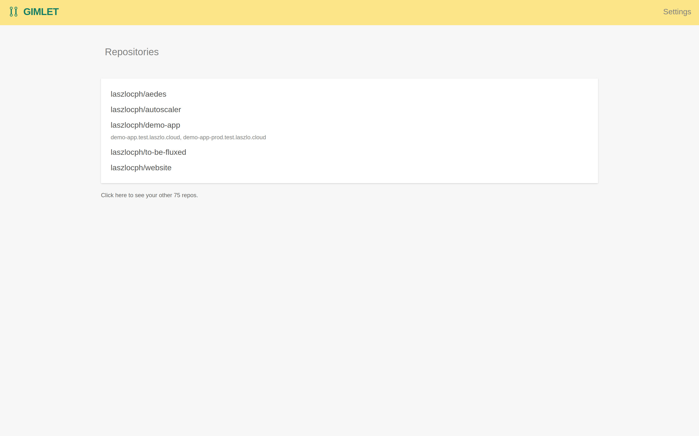
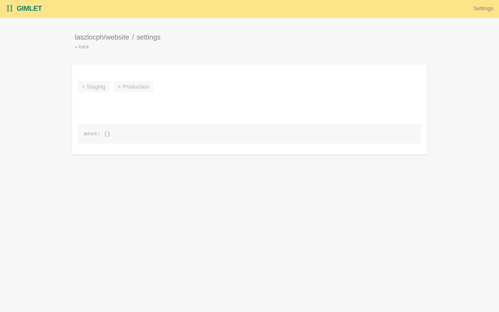
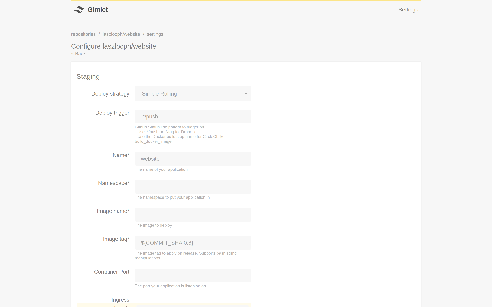
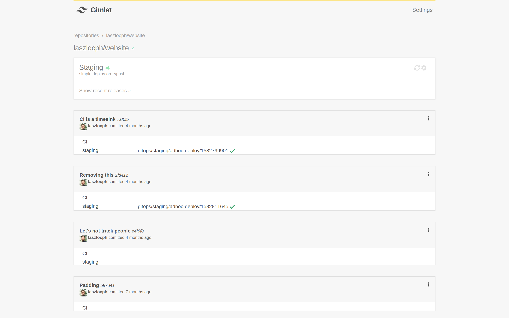

# Deploying a new service

In this guide you are going to deploy a new service on Kubernetes using the Gimlet UI.

## Locate your Github repository

Gimlet integrates with your organization's Github account, and you can see your available Github repositories on Gimlet's main page.

Navigate to https://${mycompany}.gimlet.io and see the list of repositories.



Gimlet lists the already deployed repositories on the top.

If you wish to deploy a new repository, expand the repository list and find the git repository of your application.


!!! warning ""

    If you can't find your repository, contact your Kubernetes administrator, or the person who set up your Gimlet account.
    
    She may have chosen to allow only the subset of your git repositories to be visible in Gimlet.
    She can grant additional permissions following the [Github Integration](../reference/github.md) guide.

## Configure a deploy environment

Once you found and selected your git repository, Gimlet shows a list of deployment environments where you can deploy your application.

The names of the deployment environments should sound familiar as your Kubernetes administrator has set them up for you. 



Start configuring an environment by adding a new configuration with the `+` buttons.

!!! warning ""

    If you don't have the desired environment listed, contact your Kubernetes administrator, or the person who set up your Gimlet account.
    
    She can add more deploy environments by connecting a new [Gimlet Agent](../setup/agent.md) in the target Kubernetes cluster.

## Set the mandatory fields

Gimlet abstracts the many knobs and levers that a Kubernetes cluster exposes to developers, so you can start deploying quickly.

Set the few required fields to get started, Gimlet provides good defaults for the rest.

- **Name** - inferred already from the git repository name
- **Namespace** - your Kubernetes administrator has already communicated this. Most likely it's going to be your team's namespace.
- **Image name** - the image name you set in your CI pipeline
- **Image tag** - the image tag that you set in your CI pipeline. You have the possibility to use a set of built in variables here. 

!!! note ""

    See the all the available deployment options in the [Deployment options](reference/options.md) reference.



!!! note ""

    You may have noticed that while you were setting the environment options, Gimlet updated the `.gimlet.yaml` config at the bottom of the page.
    
    If you prefer you can skip using the Gimlet UI, and enable deployment right in your source code.
    Follow the [`.gimlet.yaml`](developers/gimlet-yaml.md) guide for more details

    ```yaml
    envs:
      staging:
        - name: website
          namespace: marketing
          trigger: .*/push
          image: myregistry.com/website
          tag: '${COMMIT_SHA:0:8}'
          replicas: 1
    ```

## Deploy a revision

Let's trigger an ad-hoc deployment now that you have configured a deployment environment.



Pick the any commit from the commit list and in the hamburger menu on the right side. Click `Deploy to staging`
- given that you configured the *staging* environment in the previous step.

!!! note ""

    Please note that the ad-hoc deploy will only succeed if you have a Docker image built already for the given commit.
    
    Revisit the *Image name* and *Image tag* fields in the [Set mandatory fields](#set-the-mandatory-fields) section to see what you configured.
    Jump to the [Deployment workflows](deploy-workflows.md) guide for more information on CI and Gimlet interplay.

<!-- Fathom - beautiful, simple website analytics -->
<script src="https://cdn.usefathom.com/script.js" site="KVEHKPCQ" defer></script>
<!-- / Fathom -->