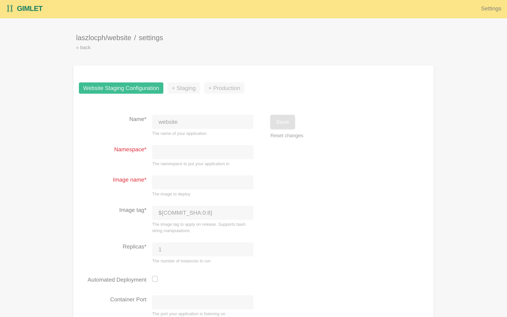

# Preview environments

In this guide you learn how you can set up per branch preview environments.

## Preview environments

It's a common practice to deploy feature branches on a unique URL, making it possible to check a new feature.

## Branch view

Branch tab on the commits view

List of preview environments

## Enable preview environments

You can enable preview environments in the deployment settings.

Click the deploy settings icon, then locate the `Preview Environments` group.

**Branch pattern** allows you to specify a pattern to only deploy feature branches that follow a specific naming convention
`feature/.*` or `.*`

**URL schema** allows you to specify a naming convention for the URl where Gimlet deploys the preview environment.
`${BRANCH}`

## Trigger a preview environment deploy

Make a commit on a feature branch

alternative: manual on branch view - TODO

## Cleanup

The preview environments are cleaned up when

- the feature branch is deleted
- or when it is merged to master
