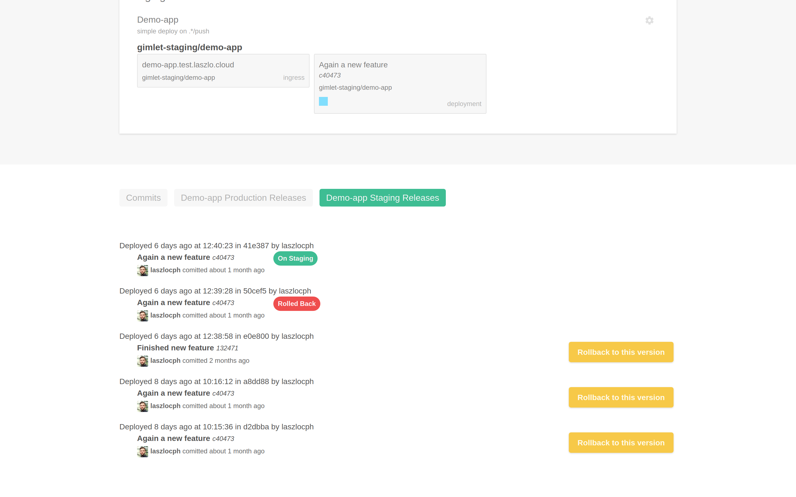

# Rollback

In this guide you will see how the GitOps repository serves as an audit log of your changes, and learn how to initiate a rollback.

!!! note ""

    In any case, you can deploy any revision on demand.
    See [Deploy a revision](/developers/deploy#deploy-a-revision) section from the Deploying a new service guide to do that.
    
    This page is about reverting changes that we recently made - in a bulletproof way - using the GitOps repository.

## Revision history

A deployment in Gimlet always results in a new commit in the GitOps repository. This guarantees that every action leaves a trail, and it makes it instantly reversible too.

You can view past revisions directly in git, or on the Gimlet UI by using the pill menu and clicking the `xxx Releases` button.

You can track your most recent releases:

- when they were made by whom
- what version of the application was deployed

!!! note ""

    - In case you would like to get a better understanding of GitOps, check out the [GitOps](/concepts/gitops) page
    - or to see how Gimlet works with the GitOps repository, check the [How components interact](/concepts/architecture#how-components-interact) section.

## Rolling back

When you decided what version you would like to rollback to, click the `Rollback to this version` button. 

Gimlet instantly reverts to the state of this version.

## Rollback guarantees
Technically, Gimlet takes all the GitOps commits of newer releases and places a revert commit for each.

This is the complete inverse of the changes made in newer commits.

This restores the exact state of the desired version, and makes the rollback traceable in the GitOps repository too. No history is lost.
