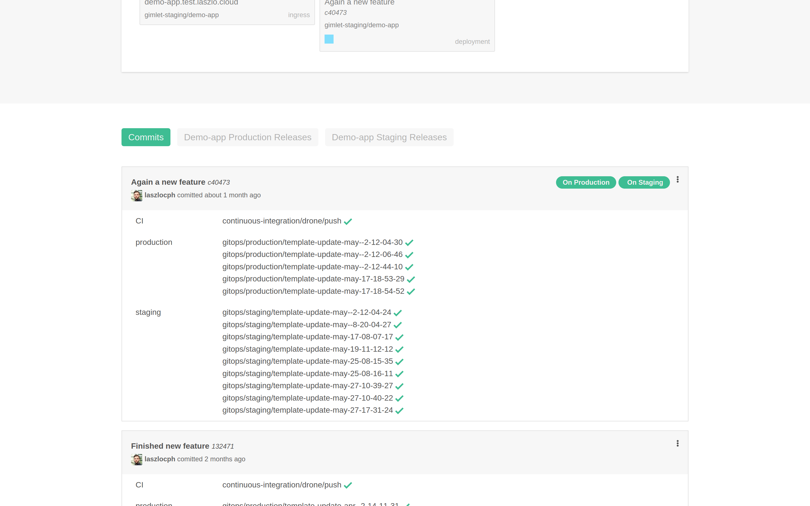

# The repository UI

This is an introduction to Gimlet's repository view, where day-to-day tasks happen.

## UI structure

Gimlet shows you one git repository at a time with all related Kubernetes entities.
You, as a developer, are able to focus on your application without any distraction.

The repository view combines your code revisions, and your deployed application together, 
so you can follow in real time what version is deployed, make quick changes when you need to.

## Kubernetes view

On the top of the screen you see a live view of all deployed Kubernetes resources related to your application.

#### Environments
You deploy your application to multiple environments. In the Kubernetes view, you can follow along all the environments all at once.
Like on the above screenshot, the demo app is deployed to *Staging* and *Production*.
#### Ingresses
The Kubernetes Ingress resource defines how your application is accepting traffic from outside of the cluster. 
On the Kubernetes view, you can follow your application's ingresses and associated host names.

#### Deployments
Gimlet shows the Kubernetes Deployments related to the application. With a quick reference to the deployed git revision.

#### Pods
Pods are indicated under Deployments and color coded according their state.

#### Errors
Should you have any deployment error, Gimlet surface the root cause on the UI, and helps with possible actions. 

## Git view

The second part of the screen shows an up-to-date view of your git repository. You can see your commits, see which ones are deployed currently and where.
You can also promote any revision to any environment in the context menu.

The pill menu allows you to look at recent releases too. If you need to rollback, follow the [Rollback](rollback.md) guide.
